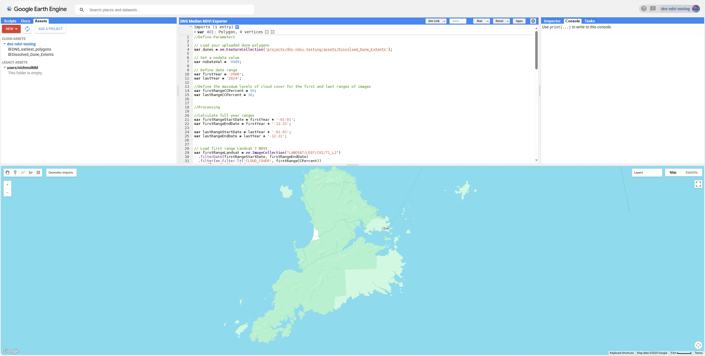
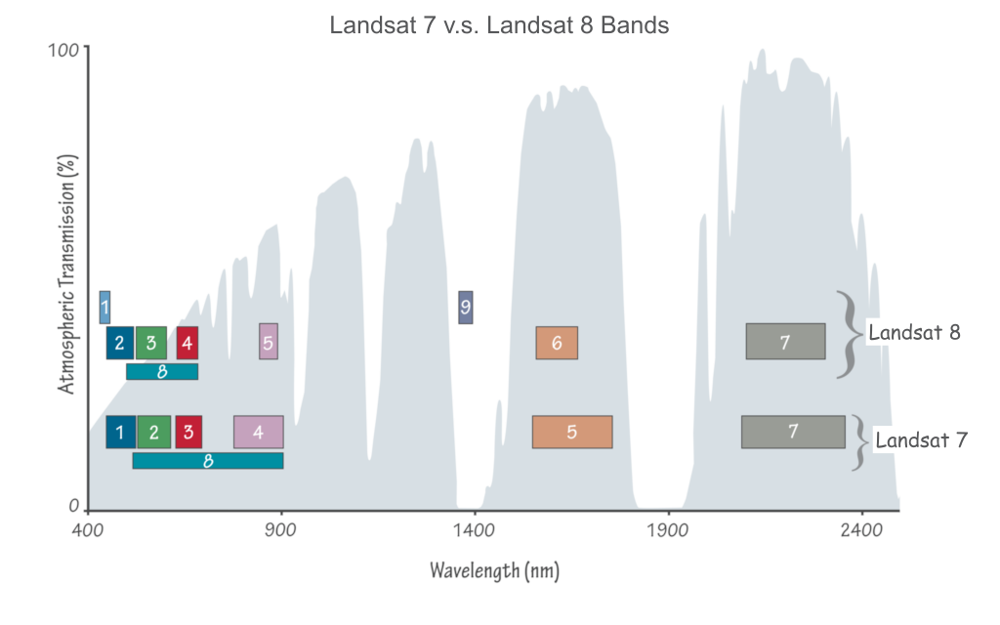
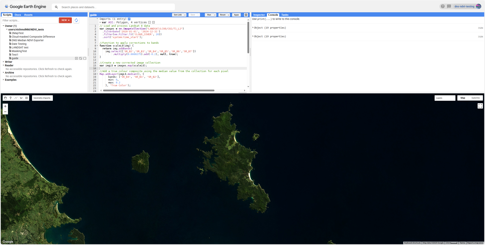
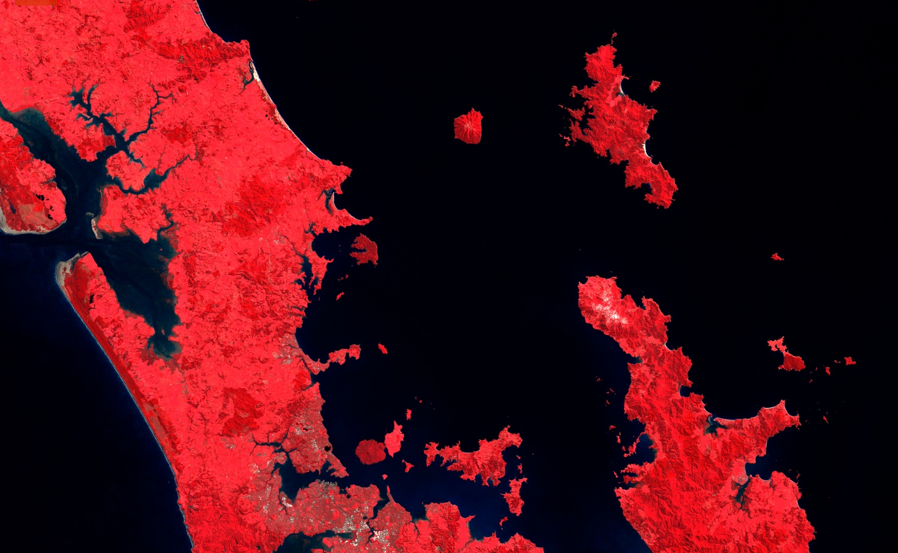
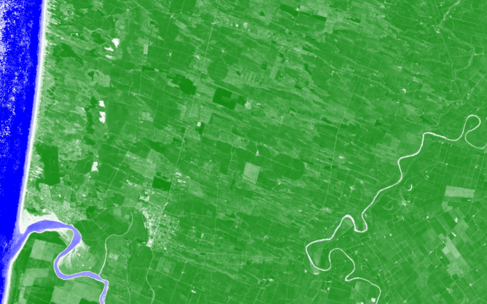
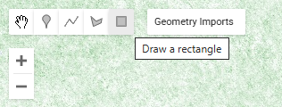
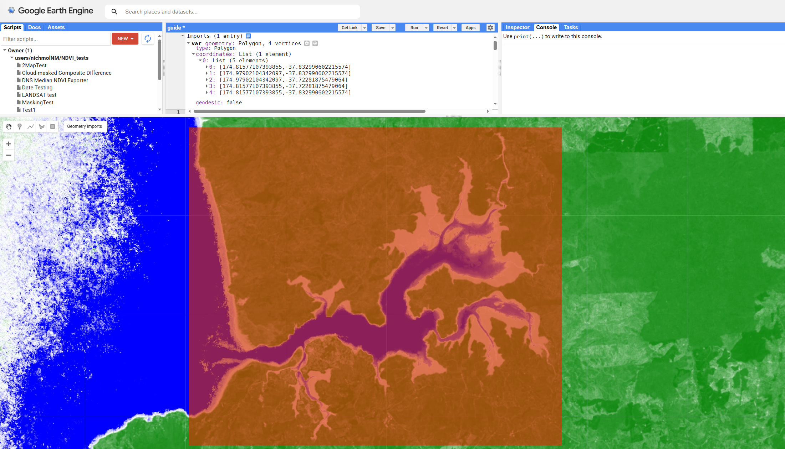
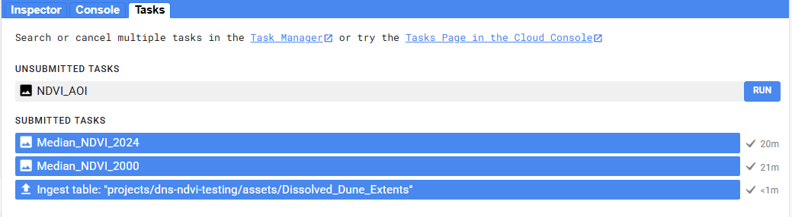
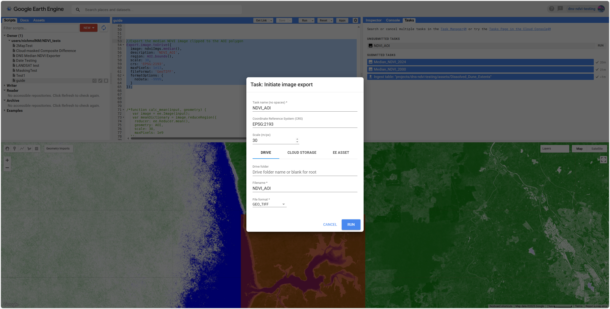

# Using Google Earth Engine for assessing coastal dune vegetation changes
### By Nicholas Molloy


## About Earth Engine
_Earth Engine_ is a cloud based platform for analysing and visualising remote sensing data developed by Google. It allows a vast catalogue of satellite data to be efficiently accessed and processed using user-created algorithms.

The Earth Engine API is provided in Python and JavaScript. These APIs are simple yet very powerful tools which can quickly process large quantities of data by leveraging Google's cloud computing resources. 

In this guide the web-based Earth Engine code editor is used to create earth engine apps, simple GUI based web applications that are easy to deploy and share. The Earth Engine code editor is an online IDE (Integrated development environment) that allows the development of JavaScript earth engine algorithms and the visualisation of the resulting data on the integrated map. It also allows final data products to be exported in standard formats such as GeoTIFFs which can be used in desktop GIS applications like QGIS and ArcGIS.

## Getting Started
To get started, you will need a Google account. Navigate to the [Getting Started](https://code.earthengine.google.com/register) page and sign in with your Google account. Then proceed through the setup process and complete the form to apply for free non-commercial use and set up your first Earth Engine project. 

Once you get through the setup process, navigate to the [Earth Engine code editor](https://code.earthengine.google.com/). You will be greeted by the earth engine IDE which which looks like this:
 


You will notice there are three panels on the top half of the screen and a map on the bottom half. The central panel is the text editor where you will write the algorithms that Earth Engine will execute in JavaScript. When you open Earth Engine this will be labelled New Script. Each script can be used to run algorithms and to build an Earth Engine app.

## Adding and visualising data
We can start by adding the data we want to use. We do this by creating an image collection as a JavaScript variable, defining the platform (e.g. Landsat, Sentinel, Modis) and level of product we want and then applying various filters. In the code block below, I create an image collection from Landsat 8 Level 2 Collection 2 Tier 1 and filter it to only include images taken between 2000 and 2024.


```javascript
// Load and process Landsat 8 data
var images = ee.ImageCollection("LANDSAT/LC08/C02/T1_L2")(
  .filterDate('2000-01-01', '2024-12-31')
  .sort('system:time_start')
  .map(scaleL8)
  );
```
<br>

*Level 2 images refer to images that have undergone additional processing to provide more accurate and usable products for scientific analysis. Collection 2 refers to images that have undergone a reprocessing effort that improved georectification and radiometric calibration. While Tier 1 refers to the best quality images from the Landsat archive.*

<br>

Now what we have now is a collection of images, not an individual image. If we want to visualise the data we need to either select a single image (for example the image with the lowest cloud cover) or use some way to summarise the collection and produce a multi-image composite. There are a variety of ways of doing this such as taking the mean or median pixel value from the collection or by choosing a particular image such as the least cloudy one for example.

Now lets look at how we would add a false colour near-infrared composite image to the map. Firstly we need to scale the pixel values, converting the raw digital numbers (DN) to surface reflectance values (ranging between 0 and 1). While this is not strictly required for just displaying an image, its required if we want to do any form of quantitative analysis such as calculating NDVI so its best to do this now. For the non-thermal bands from both Landsat 7 and Landsat 8 the correction formula is as follows:

$$
Reflectance = DN \times 0.0000275 - 0.2
$$

We can write a function to apply this correction to the appropriate bands. Then we pass the image collection through this correction formula, creating a new corrected image collection.

```javascript
//Function to apply corrections to bands
function scaleL8(img) {
  return img.addBands(
    img.select(['SR_B1','SR_B2','SR_B3','SR_B4','SR_B5','SR_B6','SR_B7'])
         .multiply(0.0000275).add(-0.2), null, true);
}

//Create a new corrected image collection
var imgL8 = images.map(scaleL8);
```

<br>

Now that we have applied the correction we can display an image. We need to choose the bands we want to display. To do this we have to choose the bands we want to use. Bands are numbered sequentially with increasing wavelength. Note that, as shown in the diagram below, the bands are offset by 1 between Landsat 7 and 8. This is because Landsat 8 added an extra *deep blue* band as band 1.



To summarise, the following table shows the most commonly used bands and their Landsat 7 and 8 band numbers:

| Band Name       | Landsat 7      | Landsat 8      |
|-----------------|----------------|----------------|
| Blue            | Band 1         | Band 2         |
| Green           | Band 2         | Band 3         |
| Red             | Band 3         | Band 4         |
| Near-Infrared   | Band 4         | Band 5         |

<br>

So to render a Landsat 8 true colour image we need bands 2, 3 and 4. We do this using the addLayer function as shown below. Because we still have a collection of images we can produce a produce a median pixel composite by using the .median() function. We can manually set the minimum and maximum brightness values in order to adjust the contrast of the image to make sure it doesn't appear either too dark or overexposed. I have found a range of 0 to 0.2 tends to work well for true colour images, so that's what I've used here.

```javascript
//Add a true colour composite using the median value from the collection for each pixel
Map.addLayer(imgL8.median(), {
      bands: ['SR_B4', 'SR_B3', 'SR_B2'],
      min: 0,
      max: 0.2
    }, 'True Color');
```
Now we have everything we need to visualise the Landsat imagery, here's the complete code up to this point:

```javascript
// Load and process Landsat 8 data
var images = ee.ImageCollection("LANDSAT/LC08/C02/T1_L2")(
  .filterDate('2000-01-01', '2024-12-31')
  .sort('system:time_start')
  .map(scaleL8)
  );

//Function to apply corrections to bands
function scaleL8(img) {
  return img.addBands(
    img.select(['SR_B1','SR_B2','SR_B3','SR_B4','SR_B5','SR_B6','SR_B7'])
         .multiply(0.0000275).add(-0.2), null, true);
}

//Create a new corrected image collection
var imgL8 = images.map(scaleL8)

//Add a true colour composite using the median value from the collection for each pixel
Map.addLayer(imgL8.median(), {
      bands: ['SR_B4', 'SR_B3', 'SR_B2'],
      min: 0,
      max: 0.2
    }, 'True Color');
```

To execute the script simply click the *run* button along the top ribbon of the central code panel. On the map zoom into the location of interest. The true colour layer will start loading and render in blocks, it may take a few seconds to be fully rendered. Note that a progress bar will appear in the layers tab on the top right of the map panel. This tab also allows layers to be turned on and off.



Now, if we want to visualise a false colour near-infrared, we simply change the bands in the addLayer function. Because vegetation tends to reflect near-infrared very strongly, a higher maximum brightness is appropriate, so I set this to 0.3.

``` javascript
//Add a true colour composite using the median value from the collection for each pixel
Map.addLayer(imgL8.median(), {
      bands: ['SR_B5', 'SR_B4', 'SR_B3'],
      min: 0,
      max: 0.3
    }, 'True Color');
```

The false-colour near-infrared imagery should look like this:




## Calculating and visualising radiometric indices (NDVI)
Now, what if we want to calculate and visualise a spectral index such as NDVI? To do this, we need to use the following formula, making use of the red (R) and near-infrared (NIR) reflectance values.

$$
NDVI = \frac{NIR-R}{NIR+R}
$$

We can use the .map() function to run an NDVI calculation function over the entire corrected image collection. We can then add a median NDVI composite image to the map. The NDVI layer will have only a single band, so we can use a colour ramp to create a an intuitive and visually appealing way to display the data. In this example, I use a blue-to-white-to-green colour ramp. 

``` javascript
//Function to calculate NDVI
function calcNDVI(image) {
    var srBands = image.select(['SR_B5', 'SR_B4'])
    var ndvi = srBands.expression(
      '(NIR - RED) / (NIR + RED)', {
        'NIR': srBands.select('SR_B5'),
        'RED': srBands.select('SR_B4')
      }).rename('NDVI');
    return ndvi.copyProperties(image, ['system:time_start']);
}

//Perform the NDVI calculation over the corrected image collection
var ndviImgs = imgL8.map(calcNDVI);

//Add the median NDVI layer to the map
Map.addLayer(ndviImgs.median(), {min: -1, max: 1, palette: ['orange', 'white', 'green']}, 'Median NDVI');
```
<br>
The resulting NDVI layer should look like this:
<br>


<br>

## Exporting Products
Earth Engine also allows for data products to be exported for use in GIS programs. To do this we need to begin by defining the area we want to download the data for. The map panel has a built in tool that allows polygons (free form shapes or rectangles) to be drawn and used to clip the data and to be used as a bounding box for the output products. External vector data can also be uploaded as shapefiles and used in the same way. Begin by using the geometry tool and drawing a polygon around the area of interest.



Once the polygon is drawn a new variable representing the polygon will automatically be created by Earth Engine and appear at the top of the script page. This variable is called *geometry* by default but it can be renamed, in this case I choose to rename it to AOI (standing for Area of Interest).



Now we can use this polygon variable to define the area to be exported. The easiest way to export files from Earth Engine is to export them to your Google Drive using the Export.image.toDrive() function and then downloading it from there. The following function clips the median NDVI layer to the AOI polygon and initialises the task to export it as a GeoTIFF file.

``` javascript
//Export the median NDVI image clipped to the AOI polygon
Export.image.toDrive({
  //Define the layer to be exported
  image: ndviImgs.median(),
  //Set the output file
  description: 'NDVI_AOI',
  //Crop the output to the AOI polygon - this acts as the bounding box of the raster.
  region: AOI.bounds(),
  //Set the spatial resolution of the output raster, in this case I use 30 m which is the resolution of Landsat data
  scale: 30,
  //Define the Coordinate Reference System of the output raster, in this case I use NZTM2000 (EPSG code: 2193)
  crs: 'EPSG:2193',
  //Set the output file format, here I use GeoTiffs (.tiff file with georeferencing information embedded)
  fileFormat: 'GeoTIFF',
  //Define the no data value for the output. This is important if you are clipping the data to a polygon smaller than the output bounding box. -9999 is a value conventionally used to represent no data pixels.
  formatOptions: {
    noData: -9999,
  }
});
```

However, when the above code is run it doesn't imediatly begin the export process. Instead it initialises an Earth Engine task which must be manually started. When the code is executed a new unsubmitted task will appear on the *Tasks* tab of the top right panel as shown below:



To begin the export simply click the run button. A new popup window will appear as shown below. This allows you to change some of the output parameters but those set in the code are established as the defaults. This window also allows you to choose a specific folder in your Google Drive (or to create a new one) where the output raster will be exported to. 



*Note if you plan to export a very large raster (more than 10,000 by 10,000 pixels or in spatial terms, 300 by 300 km at Landsat's maximum resolution) then the output raster will be automatically split into smaller individual parts by Earth Engine. In this case, it makes sense to create a new folder to hold all the individual component rasters. Thankfully, there are tools in ArcGIS and QGIS to mosaic these indiviudal rasters back together.*

When you click run...

## Building a basic UI

## Publishing an Earth Engine App
In order to make our algorithms more accessible (including for users without them needing an Earth Engine account), we can publish our script as an Earth Engine app. 

## More Information
Here are some more useful resources related to Earth Engine including official documentation and tutorial videos.
- [Official Google Guide: Getting started with Google Earth Engine](https://developers.google.com/earth-engine/guides/getstarted)
- 


