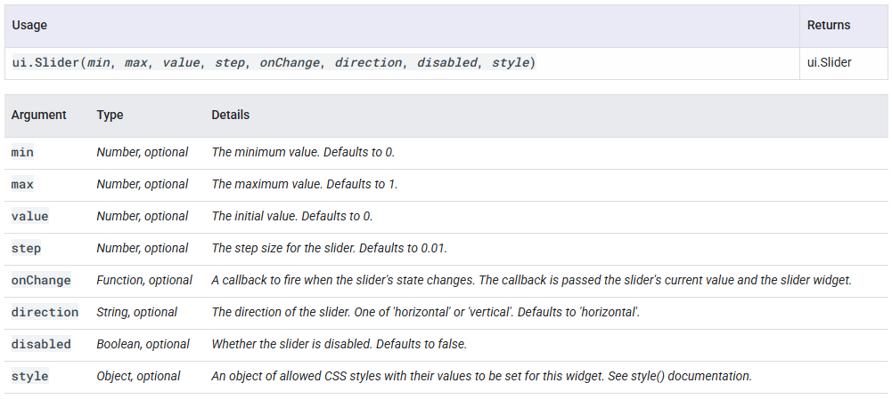
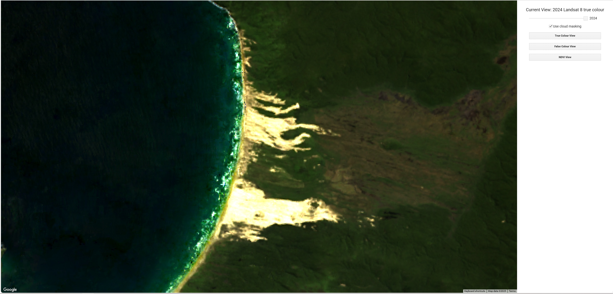
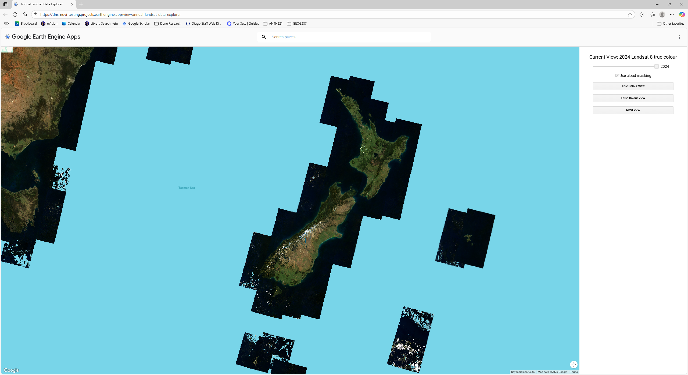

# Using Google Earth Engine for assessing coastal dune vegetation changes
### By Nicholas Molloy


## About Earth Engine
_Earth Engine_ is a cloud based platform for analysing and visualising remote sensing data developed by Google. It allows a vast catalogue of satellite data to be efficiently accessed and processed using user-created algorithms.

The Earth Engine API is provided in Python and JavaScript. These APIs are simple yet very powerful tools which can quickly process large quantities of data by leveraging Google's cloud computing resources. 

In this guide the web-based Earth Engine code editor is used to create earth engine apps, simple GUI based web applications that are easy to deploy and share. The Earth Engine code editor is an online IDE (Integrated development environment) that allows the development of JavaScript earth engine algorithms and the visualisation of the resulting data on the integrated map. It also allows final data products to be exported in standard formats such as GeoTIFFs which can be used in desktop GIS applications like QGIS and ArcGIS.

## Getting Started
To get started, you will need a Google account. Navigate to the [Getting Started](https://code.earthengine.google.com/register) page and sign in with your Google account. Then proceed through the setup process and complete the form to apply for free non-commercial use and set up your first Earth Engine project. 

Once you get through the setup process, navigate to the [Earth Engine code editor](https://code.earthengine.google.com/). You will be greeted by the earth engine IDE which which looks like this:
 


You will notice there are three panels on the top half of the screen and a map on the bottom half. The central panel is the text editor where you will write the algorithms that Earth Engine will execute in JavaScript. When you open Earth Engine this will be labelled New Script. Each script can be used to run algorithms and to build an Earth Engine app.

## Adding and visualising data
We can start by adding the data we want to use. We do this by creating an image collection as a JavaScript variable, defining the platform (e.g. Landsat, Sentinel, Modis) and level of product we want and then applying various filters. In the code block below, I create an image collection from Landsat 8 Level 2 Collection 2 Tier 1 and filter it to only include images taken between 2000 and 2024.


```javascript
// Load and process Landsat 8 data
var images = ee.ImageCollection("LANDSAT/LC08/C02/T1_L2")(
  .filterDate('2000-01-01', '2024-12-31')
  .sort('system:time_start')
  .map(scaleL8)
  );
```
<br>

*Level 2 images refer to images that have undergone additional processing to provide more accurate and usable products for scientific analysis. Collection 2 refers to images that have undergone a reprocessing effort that improved georectification and radiometric calibration. While Tier 1 refers to the best quality images from the Landsat archive.*

<br>

Now what we have now is a collection of images, not an individual image. If we want to visualise the data we need to either select a single image (for example the image with the lowest cloud cover) or use some way to summarise the collection and produce a multi-image composite. There are a variety of ways of doing this such as taking the mean or median pixel value from the collection or by choosing a particular image such as the least cloudy one for example.

Now lets look at how we would add a false colour near-infrared composite image to the map. Firstly we need to scale the pixel values, converting the raw digital numbers (DN) to surface reflectance values (ranging between 0 and 1). While this is not strictly required for just displaying an image, its required if we want to do any form of quantitative analysis such as calculating NDVI so its best to do this now. For the non-thermal bands from both Landsat 7 and Landsat 8 the correction formula is as follows:

$$
Reflectance = DN \times 0.0000275 - 0.2
$$

We can write a function to apply this correction to the appropriate bands. Then we pass the image collection through this correction formula, creating a new corrected image collection.

```javascript
//Function to apply corrections to bands
function scaleL8(img) {
  return img.addBands(
    img.select(['SR_B1','SR_B2','SR_B3','SR_B4','SR_B5','SR_B6','SR_B7'])
         .multiply(0.0000275).add(-0.2), null, true);
}

//Create a new corrected image collection
var imgL8 = images.map(scaleL8);
```

<br>

Now that we have applied the correction we can display an image. We need to choose the bands we want to display. To do this we have to choose the bands we want to use. Bands are numbered sequentially with increasing wavelength. Note that, as shown in the diagram below, the bands are offset by 1 between Landsat 7 and 8. This is because Landsat 8 added an extra *deep blue* band as band 1.


To summarise, the following table shows the most commonly used bands and their Landsat 7 and 8 band numbers:

| Band Name       | Landsat 7      | Landsat 8      |
|-----------------|----------------|----------------|
| Blue            | Band 1         | Band 2         |
| Green           | Band 2         | Band 3         |
| Red             | Band 3         | Band 4         |
| Near-Infrared   | Band 4         | Band 5         |

<br>

So to render a Landsat 8 true colour image we need bands 2, 3 and 4. We do this using the addLayer function as shown below. Because we still have a collection of images we can produce a produce a median pixel composite by using the .median() function. We can manually set the minimum and maximum brightness values in order to adjust the contrast of the image to make sure it doesn't appear either too dark or overexposed. I have found a range of 0 to 0.2 tends to work well for true colour images, so that's what I've used here.

```javascript
//Add a true colour composite using the median value from the collection for each pixel
Map.addLayer(imgL8.median(), {
      bands: ['SR_B4', 'SR_B3', 'SR_B2'],
      min: 0,
      max: 0.2
    }, 'True Color');
```
Now we have everything we need to visualise the Landsat imagery, here's the complete code up to this point:

```javascript
// Load and process Landsat 8 data
var images = ee.ImageCollection("LANDSAT/LC08/C02/T1_L2")(
  .filterDate('2000-01-01', '2024-12-31')
  .sort('system:time_start')
  .map(scaleL8)
  );

//Function to apply corrections to bands
function scaleL8(img) {
  return img.addBands(
    img.select(['SR_B1','SR_B2','SR_B3','SR_B4','SR_B5','SR_B6','SR_B7'])
         .multiply(0.0000275).add(-0.2), null, true);
}

//Create a new corrected image collection
var imgL8 = images.map(scaleL8)

//Add a true colour composite using the median value from the collection for each pixel
Map.addLayer(imgL8.median(), {
      bands: ['SR_B4', 'SR_B3', 'SR_B2'],
      min: 0,
      max: 0.2
    }, 'True Color');
```

To execute the script simply click the *run* button along the top ribbon of the central code panel. On the map zoom into the location of interest. The true colour layer will start loading and render in blocks, it may take a few seconds to be fully rendered. Note that a progress bar will appear in the layers tab on the top right of the map panel. This tab also allows layers to be turned on and off.


Now, if we want to visualise a false colour near-infrared, we simply change the bands in the addLayer function. Because vegetation tends to reflect near-infrared very strongly, a higher maximum brightness is appropriate, so I set this to 0.3.

``` javascript
//Add a true colour composite using the median value from the collection for each pixel
Map.addLayer(imgL8.median(), {
      bands: ['SR_B5', 'SR_B4', 'SR_B3'],
      min: 0,
      max: 0.3
    }, 'True Color');
```

The false-colour near-infrared imagery should look like this:


## Calculating and visualising radiometric indices (NDVI)
Now, what if we want to calculate and visualise a spectral index such as NDVI? To do this, we need to use the following formula, making use of the red (R) and near-infrared (NIR) reflectance values.

$$
NDVI = \frac{NIR-R}{NIR+R}
$$

We can use the .map() function to run an NDVI calculation function over the entire corrected image collection. We can then add a median NDVI composite image to the map. The NDVI layer will have only a single band, so we can use a colour ramp to create a an intuitive and visually appealing way to display the data. In this example, I use a blue-to-white-to-green colour ramp. 

``` javascript
//Function to calculate NDVI
function calcNDVI(image) {
    var srBands = image.select(['SR_B5', 'SR_B4'])
    var ndvi = srBands.expression(
      '(NIR - RED) / (NIR + RED)', {
        'NIR': srBands.select('SR_B5'),
        'RED': srBands.select('SR_B4')
      }).rename('NDVI');
    return ndvi.copyProperties(image, ['system:time_start']);
}

//Perform the NDVI calculation over the corrected image collection
var ndviImgs = imgL8.map(calcNDVI);

//Add the median NDVI layer to the map
Map.addLayer(ndviImgs.median(), {min: -1, max: 1, palette: ['orange', 'white', 'green']}, 'Median NDVI');
```
<br>
The resulting NDVI layer should look like this:
<br>


<br>

## Exporting Products
Earth Engine also allows for data products to be exported for use in GIS programs. To do this we need to begin by defining the area we want to download the data for. The map panel has a built in tool that allows polygons (free form shapes or rectangles) to be drawn and used to clip the data and to be used as a bounding box for the output products. External vector data can also be uploaded as shapefiles and used in the same way. Begin by using the geometry tool and drawing a polygon around the area of interest.


Once the polygon is drawn a new variable representing the polygon will automatically be created by Earth Engine and appear at the top of the script page. This variable is called *geometry* by default but it can be renamed, in this case I choose to rename it to AOI (standing for Area of Interest).


Now we can use this polygon variable to define the area to be exported. The easiest way to export files from Earth Engine is to export them to your Google Drive using the Export.image.toDrive() function and then downloading it from there. The following function clips the median NDVI layer to the AOI polygon and initialises the task to export it as a GeoTIFF file.

``` javascript
//Export the median NDVI image clipped to the AOI polygon
Export.image.toDrive({
  //Define the layer to be exported
  image: ndviImgs.median(),
  //Set the output file
  description: 'NDVI_AOI',
  //Crop the output to the AOI polygon - this acts as the bounding box of the raster.
  region: AOI.bounds(),
  //Set the spatial resolution of the output raster, in this case I use 30 m which is the resolution of Landsat data
  scale: 30,
  //Define the Coordinate Reference System of the output raster, in this case I use NZTM2000 (EPSG code: 2193)
  crs: 'EPSG:2193',
  //Set the output file format, here I use GeoTiffs (.tiff file with georeferencing information embedded)
  fileFormat: 'GeoTIFF',
  //Define the no data value for the output. This is important if you are clipping the data to a polygon smaller than the output bounding box. -9999 is a value conventionally used to represent no data pixels.
  formatOptions: {
    noData: -9999,
  }
});
```

However, when the above code is run it doesn't imediatly begin the export process. Instead it initialises an Earth Engine task which must be manually started. When the code is executed a new unsubmitted task will appear on the *Tasks* tab of the top right panel as shown below:


To begin the export simply click the run button. A new popup window will appear as shown below. This allows you to change some of the output parameters but those set in the code are established as the defaults. This window also allows you to choose a specific folder in your Google Drive (or to create a new one) where the output raster will be exported to. 


*Note if you plan to export a very large raster (more than 10,000 by 10,000 pixels or in spatial terms, 300 by 300 km at Landsat's maximum resolution) then the output raster will be automatically split into smaller individual parts by Earth Engine. In this case, it makes sense to create a new folder to hold all the individual component rasters. Thankfully, there are tools in ArcGIS and QGIS which enable us to easily mosaic these indiviudal raster sections back together.*

When you click run the export process will begin. This can take anywhere from seconds to 30 minutes or more depending on the spatial extent and resolution of the output and the complexity of the calculations required to compute the value of each cell.

## Building a basic UI
We can add UI elements to make our Earth Engine applications dynamic and to allow users to interact with the data without needing to write any code themselves.

### Adding a switch/button
We can easily add simple switches and buttons to the UI. These can be used to perform different functions, fot example to allow the user to switch back and forth between multiple layers on the map. The basic code to initialise a button is as follows:
```js
//Adding a button to the UI
var button = ui.Button({
  label: 'Button Label',
  onClick: function() {
    //Code to be executed on button press goes here
  } 
});
```
We also need to decide where to put the button in the UI. This will be covered alter on, for now we can simply put the button variable in a print statement. This will place the button within the console panel of Earth Engine.
``` js
print(button);
```

Lets add some buttons to allow the user to easily change which layer is currently been displayed on the map. 

We can start by rewriting our code so that instead of adding each of our layers to the map we instead generate their parameters and store them in an array. When the user wants to display a given layer we simply pass those parameters to a function which adds the given layer. This way we don't need to wait to load all the layers the user may want to look at, instead we only load the specific layer the user wants to look at currently. Lets make the generateLayers function work for any year, so we can simply pass in the year we want and generate the layers for the given year. This will come in handy in the next section.

``` js
//Array to store the parameters for the different layers
var layers = [];

//Function to generate the parameters for each layer for a given year
function generateLayers(year) {
  var startDate = year + '01-01';
  var endDate = year + '12-31';

  /*This pattern sets the collection we want to use depending on the year
   * If the year is less than 2014, we'll use the the Landsat 7 collection, otherwise
   * we will use the Landsat 8 collection. Note how this pattern is implemented several
   * times in the code. */
  var imgCol = year < 2014 ? "LANDSAT/LE07/C02/T1_L2" : "LANDSAT/LC08/C02/T1_L2";

  var images = ee.ImageCollection(imgCol)
  .filterDate(startDate, endDate)
  .filter(ee.Filter.lt('CLOUD_COVER', 20))
  .sort('system:time_start');

  var imgsCorr = images.map(scaleBands);
  var NDVIcol = year < 2014 ? imgsCorr.map(calcNDVIL7) : imgsCorr.map(calcNDVIL8);

  //Populate the layers array with the layer parameters
  layers = [
    {
      name: "Landsat " + (year < 2014 ? "7 " : "8 ") + "true colour",
      image: imgsCorr.median().select(year < 2014 ? ['SR_B3','SR_B2','SR_B1'] : ['SR_B4','SR_B3','SR_B2']),
      visParams: {bands: (year < 2014 ? ['SR_B3','SR_B2','SR_B1'] : ['SR_B4','SR_B3','SR_B2']), min: 0, max: 0.2}
    },
    {
      name: "Landsat " + (year < 2014 ? "7 " : "8 ") + "false colour",
      image: imgsCorr.median().select(year < 2014 ? ['SR_B4','SR_B3','SR_B2'] : ['SR_B5','SR_B4','SR_B3']),
      visParams: {bands: (year < 2014 ? ['SR_B4','SR_B3','SR_B2'] : ['SR_B4','SR_B3','SR_B2']), min: 0, max: 0.3}
    },
    {
      name: "Landsat " + (year < 2014 ? "7 " : "8 ") + "NDVI",
      image: NDVIcol.median().select('NDVI'),
      visParams: {min: -1, max: 1, palette: ['blue', 'white', 'green']}
    }
  ];
}

//For now lets just use 2024
generateLayers(2024);

// Add the default layer before the user clicks any buttons (true colour)
Map.addLayer(layers[0].image, layers[0].visParams, layers[0].name);
```

Lets write a function to add a given layer to the map and clear the existing layer. Writing a function means we don't need to repeat this code for each button, we just need to change the index in the layer array we're selecting (Index 0 in the array is true colour, Index 1 is false colour near-infrared and Index 2 is NDVI). 
``` js
/* Variable to keep track of what layer is currently being displayed.
This will come in handy when we add the ability to switch year, 
so the selected view doesn't change when the year changes */
var currentIndex = 0;

//Function to add the selected layer to the map and clear the existing layers
function updateMapLayers(selectedIndex) {
  // Clear and update map layer
  Map.layers().reset();
  var layer = layers[selectedIndex];
  currentIndex = selectedIndex;
  Map.addLayer(layer.image, layer.visParams, layer.name);
}
```
Okay, now we've written the supporting logic we can add the buttons themselves.
``` js
//Add a button to switch to true colour
var buttonTrueColour = ui.Button({
  label: 'True Colour View',
  onClick: function() {
    //Update the map with the first layer in the array (true colour)
    updateMapLayers(0);
  } 
});

//Add a button to switch to false colour near-infrared
var buttonFalseColour = ui.Button({
  label: 'False Colour View',
  onClick: function() {
    //Update the map with the second layer in the array (false colour near-infrared)
    updateMapLayers(1);
  } 
});

//Add a button to switch to NDVI view
var buttonNDVI = ui.Button({
  label: 'NDVI View',
  onClick: function() {
    //Update the map with the third layer in the array (NDVI)
    updateMapLayers(2);
  } 
});

//Add the buttons to the console
print(buttonTrueColour);
print(buttonFalseColour);
print(buttonNDVI);
```

Nice! This code should work nicely. Now how can we allow the user to choose which year they want?

### Adding a slider widget
We can also add a slider that allows the user to choose a specified numeric input from a given range we define. We can use this to allow the user to choose which year's data they want to look at. To add a slider, the basic code is as follows:
```js
//Add a slider
var slider = ui.Slider();
slider.onChange(function(value) {
  //Code to be executed on slider change goes here
});
```
We can modify the slider's behaviour by passing values to it when we initialise it.
```js
var slider = ui.Slider(/*input parameters to modify slider go here*/)
```
Note the input parameters shown below. 

So to create a slider that allows values between 2000 and 2024, with a minimum step of 1 we would do this:
```js
//Add a slider that allows whole numbers between 2000 and 2024 with a default value of 2024
var slider = ui.Slider({
  min: 2000,
  max: 2024,
  step: 1,
  value: 2024
});

//Add the slider to the console panel
print(slider);
```
Now we can write the logic to update the layers. We've already done most of the work so this is easy. We call the updateMapLayers() function again, using the currentIndex value we created earlier so the selected view stays the same when the year changes.
```js
slider.onChange(function(value) {
  //Generate the layers for the given year
  generateLayers(value);
  //Update the current view to the given year
  updateMapLayers(currentIndex)
});
```
### Adding a label
Another useful Google Earth widget is the label widget. We might want to let the user easily see which view and which year they are currently viewing. We can use a label to do this by dynamically updating its text when the year/view changes. We add a label like this:
```js
//Add a basic label
var label = ui.Label('Basic Label');
```

We can dynamically update the text using the .setValue() function.
```js
//Update the labels text
label.setValue("Updated Label");
```

By implementing this functionality in the updateMapLayers() function we can change the text when the current view changes. We can easily add this functionality to our app by calling the label.setValue() function within the updateMapLayers() function.

### More widgets
There are several more UI widgets avaialble such as date sliders, check boxes and text inputs. [Read about them in the official documentation](https://developers.google.com/earth-engine/guides/ui_widgets).

### Arranging UI elements
For now we've just been putting our widgets into the console using the print() function. There are however cleaner ways to arrange elements and it is possible to create a custom UI. Google Earth Engine allows us to modify our app's layout and choose where to place our UI elements. We arrange custom UI elements by placing them in containers called panels. We create a panel like this:
```js
// Create a UI panel and define its styling
var panel = ui.Panel({
  layout: ui.Panel.Layout.flow('vertical'), 
  style: {
    width: '400px',
    padding: '20px'
  }});
```
Here, I make it so the widgets will be stacked vertically in the panel and set the style of the panel so it will be 400 pixels wide and have a padding of 20 px.

To add the panel to our UI we simply do this:
```js
// Add the panel to the ui
ui.root.add(panel);
```

Now if we run this we will just get a blank panel. Now we need to add the widgets we made to the panel. First of, make sure to remove all the print() statements we used to print the widgets to the console, since we cannot render widgets in multiple places. To add our widgets we simply pass in an array with the names of the widgets we want to add:

```js
// Define panel styling
var panel = ui.Panel({
  layout: ui.Panel.Layout.flow('vertical'), 
  style: {
    width: '400px',
    padding: '20px'
  },
  widgets: [
    label
    slider,
    checkbox,
    buttonTrueColour,
    buttonFalseColour,
    buttonNDVI
  ]
});
```
Now, this should be starting to look nice, but I would like to centre all the items in the panel so it looks a bit nicer. We can do this simply by wrapping each of the widgets in their own panel within the main panel:
```js
  widgets: [
    // Wrap each widget in a small panel with margin: '0 auto' to center it
    ui.Panel(label, null, {margin: '0 auto'}), // Centering the label
    ui.Panel(slider, null, {margin: '0 auto'}), // Centering the slider
    ui.Panel(checkbox, null, {margin: '0 auto'}), // Centering the checkbox
    ui.Panel(buttonTrueColour, null, {margin: '0 auto'}), // Centering the button
    ui.Panel(buttonFalseColour, null, {margin: '0 auto'}), // Centering the button
    ui.Panel(buttonNDVI, null, {margin: '0 auto'}) // Centering the button
  ]
```

Now we can add a little styling to the buttons and the slider to standardise their widths and make the label text a bit bigger.

``` js
buttonTrueColour.style().set({width: '300px'});
buttonFalseColour.style().set({width: '300px'});
buttonNDVI.style().set({width: '300px'});
slider.style().set({width: '300px'});
label.style().set('fontSize', '18px');
```

Now to make the UI a little cleaner we can hide the default map widgets which we don't need like this:

```js
//clear default map UI elements
Map.setControlVisibility({all: false});
```

Voila! Now things are looking really nice.


Now we have made an application that allows the user to easily view median landsat data for any year and for any location on earth and to choose if they want to visualise it in true colour, false colour or with NDVI; all without them having to write any code. Great, now we are ready to publish this as an earth engine app.

## Publishing an Earth Engine App
In order to make our algorithms more accessible (including for users without them needing an Earth Engine account), we can publish our script as an Earth Engine app.

Begin by clicking the Apps button along the top ribbon of the main code panel. In the window that opens click the New App button. Proceed through the steps, set the permissions for who will be able to edit the app and choose a name for the app. Then choose the script you want the app to run on, keep it on "current contents of editor" to use the script that is currently open. You can then write a description for your app, and choose whether you would like it to appear in the Public Apps Gallery. You can also choose if you would want the app to only be viewable by people in a given Google Group (allowing you to controll which accounts can view it). A custom logo can also be also be upploaded if desired.

Now simply click Publish the app. It may take a few minutes but your app will now be live and ready to use!



You can easily update the app if you want to make changes by simply changing the script and saving the changes. You can also edit other app parameters by clicking on the Apps button again and then clicking on the edit icon for your app. You can also overwrite your app's code with that from another script file if you so choose.

Hopefully you can now build an earth engine app! If you want any more information check the useful links I've provided in the More Information section. There are also much more useful resources available online. Generative AI tools like ChatGPT and Gemini can also be useful for creating Earth Engine code but be wary, they will sometimes create code that doesn't work or even hallucinate functions that don't exist in Earth Engine. Use with caution!

Finally, while I'm not an expert in Earth Engine, I can do my best to answer any queries.
Email me at molni576@student.otago.ac.nz

## More Information
There are many useful resources and tutorial videos about Google Earth engine available online. Here are a few useful general resources including official documentation and tutorial videos:
- [Official Google Guide: Getting started with Google Earth Engine](https://developers.google.com/earth-engine/guides/getstarted)
- [Introduction to Google Earth Engine | Official Google Workshop Tutorial Playlist from 2023 Geo for Good Summit](https://www.youtube.com/playlist?list=PLLW-qoCMKQsx62nKon2-0PMtGzkxlwN7k)
- [Google Earth Engine 101: An Introduction for Complete Beginners | Tutorial Video by Stanford Geospatial Center](https://www.youtube.com/watch?v=oAElakLgCdA)


